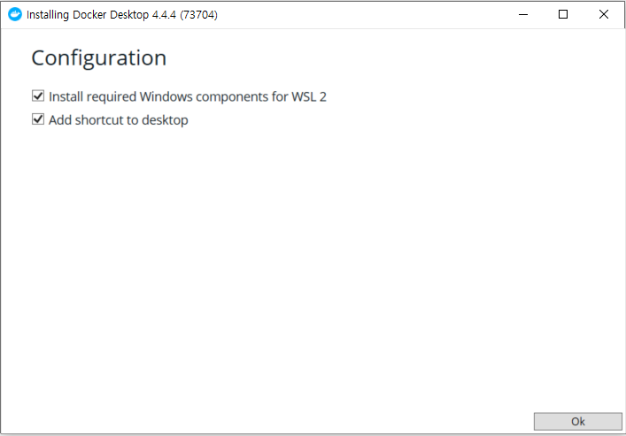

# Docker

##### 1️⃣ Docker란?

- 컨테이너 기반의 오픈소스 가상화 플랫폼
- 리눅스 컨테이너를 기반으로 하여 특정한 서비스를 패키징하고 배포하는데 유용한 오픈소스 프로그램

<br>

##### 2️⃣ Docker 사용 이유

- Docker hub에 올라온 이미지와 Docker-compose.yml의 설정을 통해 원하는 프로그램을 편하게 설치 가능
  
    → 컨테이너를 생성하여 분리된 환경에서 설치하므로 제거도 편리함
    
- 하나의 서버에 포트만 변경하여 동일한 프로그램을 실행하기 쉬움

<br>

##### 3️⃣ Docker 특징

1. 확장성과 이싱성
    1. 도커가 설치되어있는 곳이라면 어디든지 컨테이너 실행 가능
    2. 오픈소스이기 때문에 특정 회사나 서비스에 종속적이지 않음
    3. 개발서버나 테스트 서버를 쉽게 생성 가능
2. 표준성
    1. 컨테이너라는 표준으로 서버를 배포하기에 모든 서비스들의 배포 과정이 동일해짐
3. 이미지
    1. 컨테이너를 실행하기 위한 압축파일과 같은 개념
    2. 이미지에서 컨테이너를 생성하기 때문에 반드시 이미지는 만들어야 함!
    3. Dockerfile을 이용하여 이미지 생성
4. 설정 관리
    1. 하나의 이미지가 환경변수에 따라 동적으로 설정파일을 생성하도록 만들어야함
5. 자원관리
    1. 컨테이너는 삭제 후 새로 만들면 모든 데이터는 초기화됨
    2. 세션이나 캐시는 memcached나 redis와 같은 외부로 분리

<br>

##### 4️⃣ Docker - 컨테이너 실행

- run 명령어 사용 → 이미지 저장여부 확인 = No → 다운로드(pull) → 컨테이너 생성(create) → 시작(start)

```bash
docker run [OPTIONS] IMAGE[:TAG|@DIGEST] [COMMAND] [ARG...]
```

| 옵션 | 설명 |
| --- | --- |
| -d | detached mode(백그라운드 모드) |
| -p | 호스트와 컨테이너의 포트 연결(포워딩) |
| -v | 호스트와 컨테이너의 디렉토리 연결(마운트) |
| -e | 컨테이너 내에서 사용할 환경변수 설정 |
| -name | 컨테이너 이름 설정 |
| -rm | 프로세스 종료시 컨테이너 자동 제거 |
| -it | -i와 -t를 동시에 사용한 것, 터미널 입력을 위한 옵션 |
| -link | 컨테이너 연결 |

<br>

##### 5️⃣ Docker 기본 명령어

- 컨테이너 목록 확인하기

```bash
	docker ps [OPTIONS]                 // -a, --all
```

- 컨테이너 중지하기

```bash
docker stop [OPTIONS] CONTAINERS NAME
```

- 이미지 목록 확인하기

(사용하지않는 이미지는 지우는게 좋음..)

```bash
docker images [OPTIONS] [REPOSITORY[:TAG]]
```

- 이미지 다운로드 하기
    - run 명령어를 사용하면 자동으로 pull이 되고, pull 명령어를 사용하면 이미지가 최신화된다.

```bash
docker pull [OPTIONS] NAME[:TAG|@DIGEST]
```

- 이미지 삭제하기

```bash
docker rmi [OPTIONS] IMAGES
```

- 컨테이너 로그보기
    - —tail 10 : 마지막 10줄만 출력
    - -f : 실시간으로 생성되는 로그 확인

```bash
docker logs [OPTIONS] CONTAINER
```

- 이미지 생성하기(빌드)

```bash
docker build [OPTIONS] PATH | URL | -
```

<br>

##### 6️⃣ 설치 방법(로컬)

❗리눅스에서 도커 설치 방법은 ‘EC2 서버 세팅 & 배포’에서 참고❗

1. 공식 사이트에서 도커 다운로드
    - [https://www.docker.com/get-started](https://www.docker.com/get-started)
      
        
        

1. 설치 후 재부팅을 진행한다.
   
    
    
1. Accept를 체크하고 확인한다.
   
    
    
1. 설치 후 이러한 경고창이 뜨면 WSL 2를 활성화해줘야한다.
   
    
    
1. Windows PowerShell을 관리자 권한으로 실행한다.
   
    
    
1. Linux용 Windows 하위 시스템을 활성화한다.
    - 명령어 : dism.exe /online /enable-feature /featurename:Microsoft-Windows-Subsystem-Linux /all /norestart
    
    
    
1. 가상머신 기능 활성화
    
- 명령어 : dism.exe /online /enable-feature /featurename:VirtualMachinePlatform /all /norestart
    
1. WSL 활성화하기 위해 재부팅을 진행한다.

1. Linux 커널 업데이트 패키지를 다운로드 한다.
   
    
    
1. 설치 후 WSL2를 기본 버전으로 설정한다.
   
    
    
1. 설치 완료 후 Restart를 누르면 Docker가 잘 실행됨을 확인할 수 있다.
   
    
    

<br>

<br>

**📚 References**

- [https://myjamong.tistory.com/296](https://myjamong.tistory.com/296)
- [https://wooody92.github.io/docker/Docker-도커란-무엇인가/](https://wooody92.github.io/docker/Docker-%EB%8F%84%EC%BB%A4%EB%9E%80-%EB%AC%B4%EC%97%87%EC%9D%B8%EA%B0%80/)
- [https://subicura.com/2017/01/19/docker-guide-for-beginners-2.html](https://subicura.com/2017/01/19/docker-guide-for-beginners-2.html)