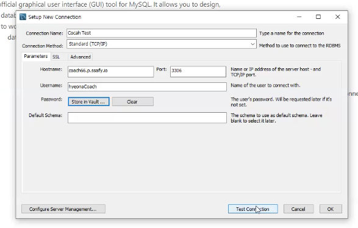
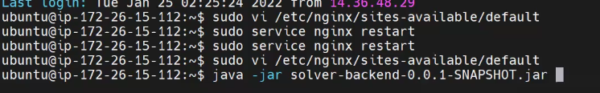
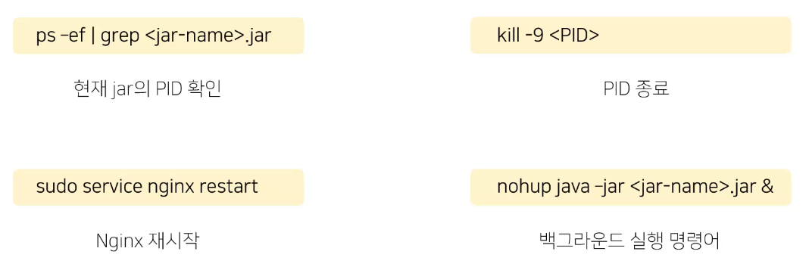
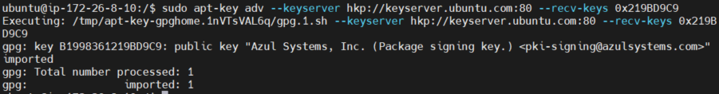
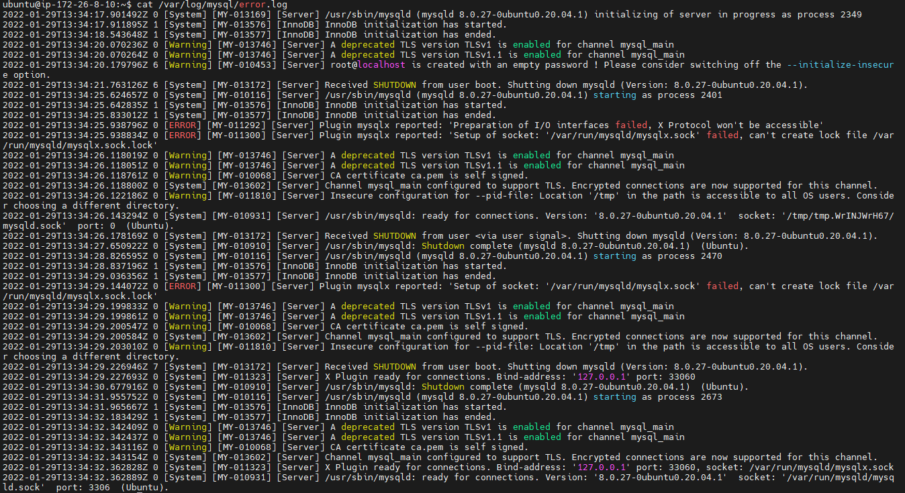

# EC2 서버 세팅 & 배포

<br>

### 기본 개념 정리

##### 1️⃣ 서버 구축방식

- 온프레미스 방식 ex) 건물 도면을 그리는 작업
- 클라우드 방식


##### **2️⃣ CLI를 다룰 수 있는 도구**

- ubuntu, PUTTY


##### 3️⃣ 기본 세팅 RoadMap

1. EC2 Ubuntu Server 접속
2. DB 구축
3. 웹서버 설치(NGINX, 아파치)
4. 프록시 서버 설치
5. 배포(npm, gradle, docker, Jenkins)


##### **4️⃣ 주의사항!**

- port 22 : 만약 방화벽 설정을 한다면 특히 22번 포트에 대한 조작은 조심해야함(ssh 기본포트)
  
    - > 서버와 안녕,, 더이상 접근이 불가능해짐
    
- DB조작 조심 : DB 날리지않도록..

- 꼼꼼히 기록하기 : 서버설정할때는 설정하는것들, 과정, 발생하는 에러들을 모두 기록으로 남겨두기(프로젝트가 이번이 끝이 아니기 때문임)


### **SSAFY에서 AWS EC2 사용하기**

(자세한 내용X, 어떠한 방식으로 공부하고, 찾아보면 되는지 길잡이 내용)

##### **1️⃣ AWS EC2 접속하기**

- MobaXterm : GUI환경이 구축되어있어 초보자가 사용하기 쉬운 툴! (CLI도 사용 가능)


##### **2️⃣ Local Workbench에 Server DB 연결하기**

- username, password는 사전에 없는 단어, 팀마다 어려운걸로 설정하기(털리는것은 물론 돈을 요구할수도 있음😢)
  
    
    
    

##### **3️⃣ Nginx 기본 설정**

1. Front build 파일 위치 설정
2. Https 설정 방법(SSL Key, request 등)녕ser
3. Proxy 설정


##### **4️⃣ 수동 배포하기**

- 기본적으로 서버에도 java 환경 등을 구축해줘야함!
  
    
    
    

##### **5️⃣ 배포 명령어**

- 기본 명령어
  
    
    
    

##### **6️⃣ 서버 사용시 질문하는 방법**

- ''어떠한 목적으로 하려고 어떠한 설정을 했는데 어떠한 오류가 발생했다'' 식으로 질문하기

<br>

### 설치 방법(java8, docker, mysql, ngnix)

<br>

##### 1️⃣ Java 8 버전 설치

1. Azul public key 추가

```bash
$sudo apt-key adv --keyserver hkp://keyserver.ubuntu.com:80 --recv-keys 0x219BD9C9
```




2. Azul repository 추가하기

```bash
$sudo apt-add-repository 'deb http://repos.azulsystems.com/ubuntu stable main'
```


3. zulu-8 설치

```bash
$sudo apt-get update
$sudo apt-get install zulu-8
```


4. 환경 변수 설정하기

```bash
$cd /etc
$sudo nano profile
```


5. 설치후 java 버전 확인하기

```bash
$java -version
```


##### 2️⃣ Docker & Docker compose 설치

1. apt 패키지 인덱스 업데이트

```bash
$sudo apt update && sudo apt upgrade
```


2. Download를 위한 Util 준비

```bash
$sudo apt-get install \
apt-transport-https \
ca-certificates \
curl \
gnupg-agent \
software-properties-common
```


3. Docker GPG key 추가

```bash
$curl -fsSL https://download.docker.com/linux/ubuntu/gpg | sudo apt-key add -
```


4. apt repo에 Docker 다운로드 경로 추가

```bash
$sudo add-apt-repository "deb [arch=amd64] https://download.docker.com/linux/ubuntu bionic stable"
```


5. 도커 다운로드 및 설치

```bash
$sudo apt-cache policy docker-ce
$sudo apt install docker-ce
$sudo apt update
```


6. sudo 없이 docker 사용을 위한 ubuntu user docker 그룹에 등록 후 서버 재부팅

```bash
$sudo usermod -aG docker ubuntu
$sudo reboot
```


7. ubuntu 계정 비밀번호 설정

- 비밀번호 설정시 입력이 안되는것처럼 보이지만 입력이 되고 있는 상태이기 때문에 한글자 한글자 조심히 입력할것!

```bash
$sudo passwd ubuntu
```


8. Docker compose 설치

```bash
$sudo curl -L https://github.com/docker/compose/releases/download/1.25.0-rc2/docker-compose-`uname -s`-`uname -m` -o /usr/local/bin/docker-compose
```


9. 실행 권한 주기

```bash
$sudo chmod +x /usr/local/bin/docker-compose
```


##### 3️⃣ Mysql 설치

1. mysql server 설치

```bash
$sudo apt update
$sudo apt-get install mysql-server
```

- mysql 설치 중 error log 확인
  
    
    
    ubuntu@ip-172-26-8-10:~$ cat /var/log/mysql/error.log
    2022-01-29T13:34:17.901492Z 0 [System] [MY-013169] [Server] /usr/sbin/mysqld (mysqld 8.0.27-0ubuntu0.20.04.1) initia          lizing of server in progress as process 2349
    2022-01-29T13:34:17.911895Z 1 [System] [MY-013576] [InnoDB] InnoDB initialization has started.
    2022-01-29T13:34:18.543648Z 1 [System] [MY-013577] [InnoDB] InnoDB initialization has ended.
    2022-01-29T13:34:20.070236Z 0 [Warning] [MY-013746] [Server] A deprecated TLS version TLSv1 is enabled for channel m          ysql_main
    2022-01-29T13:34:20.070264Z 0 [Warning] [MY-013746] [Server] A deprecated TLS version TLSv1.1 is enabled for channel           mysql_main
    2022-01-29T13:34:20.179796Z 6 [Warning] [MY-010453] [Server] root@localhost is created with an empty password ! Plea          se consider switching off the --initialize-insecure option.
    2022-01-29T13:34:21.763126Z 6 [System] [MY-013172] [Server] Received SHUTDOWN from user boot. Shutting down mysqld (          Version: 8.0.27-0ubuntu0.20.04.1).
    2022-01-29T13:34:25.624657Z 0 [System] [MY-010116] [Server] /usr/sbin/mysqld (mysqld 8.0.27-0ubuntu0.20.04.1) starti          ng as process 2401
    2022-01-29T13:34:25.642835Z 1 [System] [MY-013576] [InnoDB] InnoDB initialization has started.
    2022-01-29T13:34:25.833012Z 1 [System] [MY-013577] [InnoDB] InnoDB initialization has ended.
    2022-01-29T13:34:25.938796Z 0 [ERROR] [MY-011292] [Server] Plugin mysqlx reported: 'Preparation of I/O interfaces fa          iled, X Protocol won't be accessible'
    2022-01-29T13:34:25.938834Z 0 [ERROR] [MY-011300] [Server] Plugin mysqlx reported: 'Setup of socket: '/var/run/mysql          d/mysqlx.sock' failed, can't create lock file /var/run/mysqld/mysqlx.sock.lock'
    2022-01-29T13:34:26.118019Z 0 [Warning] [MY-013746] [Server] A deprecated TLS version TLSv1 is enabled for channel m          ysql_main
    2022-01-29T13:34:26.118051Z 0 [Warning] [MY-013746] [Server] A deprecated TLS version TLSv1.1 is enabled for channel           mysql_main
    2022-01-29T13:34:26.118761Z 0 [Warning] [MY-010068] [Server] CA certificate ca.pem is self signed.
    2022-01-29T13:34:26.118800Z 0 [System] [MY-013602] [Server] Channel mysql_main configured to support TLS. Encrypted           connections are now supported for this channel.
    2022-01-29T13:34:26.122186Z 0 [Warning] [MY-011810] [Server] Insecure configuration for --pid-file: Location '/tmp'           in the path is accessible to all OS users. Consider choosing a different directory.
    2022-01-29T13:34:26.143294Z 0 [System] [MY-010931] [Server] /usr/sbin/mysqld: ready for connections. Version: '8.0.2          7-0ubuntu0.20.04.1'  socket: '/tmp/tmp.WrINJWrH67/mysqld.sock'  port: 0  (Ubuntu).
    2022-01-29T13:34:26.178169Z 0 [System] [MY-013172] [Server] Received SHUTDOWN from user <via user signal>. Shutting           down mysqld (Version: 8.0.27-0ubuntu0.20.04.1).
    2022-01-29T13:34:27.650922Z 0 [System] [MY-010910] [Server] /usr/sbin/mysqld: Shutdown complete (mysqld 8.0.27-0ubun          tu0.20.04.1)  (Ubuntu).
    2022-01-29T13:34:28.826595Z 0 [System] [MY-010116] [Server] /usr/sbin/mysqld (mysqld 8.0.27-0ubuntu0.20.04.1) starti          ng as process 2470
    2022-01-29T13:34:28.837196Z 1 [System] [MY-013576] [InnoDB] InnoDB initialization has started.
    2022-01-29T13:34:29.036356Z 1 [System] [MY-013577] [InnoDB] InnoDB initialization has ended.
    2022-01-29T13:34:29.144072Z 0 [ERROR] [MY-011300] [Server] Plugin mysqlx reported: 'Setup of socket: '/var/run/mysql          d/mysqlx.sock' failed, can't create lock file /var/run/mysqld/mysqlx.sock.lock'
    2022-01-29T13:34:29.199833Z 0 [Warning] [MY-013746] [Server] A deprecated TLS version TLSv1 is enabled for channel m          ysql_main
    2022-01-29T13:34:29.199861Z 0 [Warning] [MY-013746] [Server] A deprecated TLS version TLSv1.1 is enabled for channel           mysql_main
    2022-01-29T13:34:29.200547Z 0 [Warning] [MY-010068] [Server] CA certificate ca.pem is self signed.
    2022-01-29T13:34:29.200584Z 0 [System] [MY-013602] [Server] Channel mysql_main configured to support TLS. Encrypted           connections are now supported for this channel.
    2022-01-29T13:34:29.203010Z 0 [Warning] [MY-011810] [Server] Insecure configuration for --pid-file: Location '/tmp'           in the path is accessible to all OS users. Consider choosing a different directory.
    2022-01-29T13:34:29.226946Z 7 [System] [MY-013172] [Server] Received SHUTDOWN from user boot. Shutting down mysqld (          Version: 8.0.27-0ubuntu0.20.04.1).
    2022-01-29T13:34:29.227693Z 0 [System] [MY-011323] [Server] X Plugin ready for connections. Bind-address: '127.0.0.1          ' port: 33060
    2022-01-29T13:34:30.677916Z 0 [System] [MY-010910] [Server] /usr/sbin/mysqld: Shutdown complete (mysqld 8.0.27-0ubun          tu0.20.04.1)  (Ubuntu).
    2022-01-29T13:34:31.955752Z 0 [System] [MY-010116] [Server] /usr/sbin/mysqld (mysqld 8.0.27-0ubuntu0.20.04.1) starti          ng as process 2673
    2022-01-29T13:34:31.965667Z 1 [System] [MY-013576] [InnoDB] InnoDB initialization has started.
    2022-01-29T13:34:32.183429Z 1 [System] [MY-013577] [InnoDB] InnoDB initialization has ended.
    2022-01-29T13:34:32.342409Z 0 [Warning] [MY-013746] [Server] A deprecated TLS version TLSv1 is enabled for channel m          ysql_main
    2022-01-29T13:34:32.342437Z 0 [Warning] [MY-013746] [Server] A deprecated TLS version TLSv1.1 is enabled for channel           mysql_main
    2022-01-29T13:34:32.343116Z 0 [Warning] [MY-010068] [Server] CA certificate ca.pem is self signed.
    2022-01-29T13:34:32.343154Z 0 [System] [MY-013602] [Server] Channel mysql_main configured to support TLS. Encrypted           connections are now supported for this channel.
    2022-01-29T13:34:32.362828Z 0 [System] [MY-011323] [Server] X Plugin ready for connections. Bind-address: '127.0.0.1          ' port: 33060, socket: /var/run/mysqld/mysqlx.sock
    2022-01-29T13:34:32.362889Z 0 [System] [MY-010931] [Server] /usr/sbin/mysqld: ready for connections. Version: '8.0.2          7-0ubuntu0.20.04.1'  socket: '/var/run/mysqld/mysqld.sock'  port: 3306  (Ubuntu).
    


2. 대소문자 구별 default 값 변경하기

- mysqld.cnf 파일에 ‘lower_case_table_names = 1’ 추가하기

```bash
$sudo service mysql stop
$sudo rm -rf /var/lib/mysql
$sudo mkdir /var/lib/mysql
$sudo chown mysql:mysql /var/lib/mysql
$sudo chmod 700 /var/lib/mysql
$cd /etc/mysql/mysql.conf.d
$sudo nano mysqld.cnf
```


3. mysql 서비스 재시작

```bash
$sudo mysqld --defaults-file=/etc/mysql/my.cnf --initialize --lower_case_table_names=1 --user=mysql --console
$sudo service mysql start
```


4. 생성된 root의 비밀번호 검색하기

```bash
$sudo grep 'temporary password' /var/log/mysql/error.log
```


5. mysql 세션 접속해서 비밀번호 변경하기

- 비밀번호를 변경해야 root계정 접속 가능!

```bash
$sudo mysql -u root -p
// password 입력
> mysql : alter user 'root'@'localhost' identified by '새비밀번호 입력';
```


6. 외부 접속 허용하기

   6-1. 모든 IP 허용하기

- mysqld.cnf 파일에 ‘bind-address = 0.0.0.0’으로 수정하기 혹은 bind-address 주석처리하기 → 같은 결과

```bash
$cd /etc/mysql/mysql.conf.d
$sudo nano mysqld.cnf
```

​	6-2. 설정 적용을 위한 재시작

```bash
$sudo service mysql restart
```

​	6-3. 사용자 계정 추가

- 사용자를 생성하고, 모든 권한(CRUD) 부여

```bash
$sudo mysql -u root -p
//password 입력
> CREATE USER 'root'@'%' IDENTIFIED BY '새 비밀번호 입력';
> GRANT ALL PRIVILEGES ON *.* TO 'root'@'%' WITH GRANT OPTION;
> FLUSH PRIVILEGES;
```


7. Public IP 조회하기

```bash
$curl ifconfig.me
```


8. Mysql Workbench를 통해 서버 DB로 접속하기


##### 4️⃣ Nginx 설치하기

1. nginx 설치한 후 버전 확인하기

```bash
$sudo apt install nginx
$nginx -v
```


##### 5️⃣ 서버에 프로젝트 Clone 받기

1. 프로젝트 clone 받기

```bash
$git clone git주소         //(.git은 제외)
// ID, Password(access token) 입력하기
```


**📚 References**

- [https://blog.naver.com/PostView.naver?blogId=jinwoo6612&logNo=222532202235&parentCategoryNo=&categoryNo=&viewDate=&isShowPopularPosts=false&from=postView](https://blog.naver.com/PostView.naver?blogId=jinwoo6612&logNo=222532202235&parentCategoryNo=&categoryNo=&viewDate=&isShowPopularPosts=false&from=postView)
- [https://bizadmin.tistory.com/entry/MySql-외부-접속-가능하게-설정하기](https://bizadmin.tistory.com/entry/MySql-%EC%99%B8%EB%B6%80-%EC%A0%91%EC%86%8D-%EA%B0%80%EB%8A%A5%ED%95%98%EA%B2%8C-%EC%84%A4%EC%A0%95%ED%95%98%EA%B8%B0)
- [https://cjh5414.github.io/mysql-create-user/](https://cjh5414.github.io/mysql-create-user/)