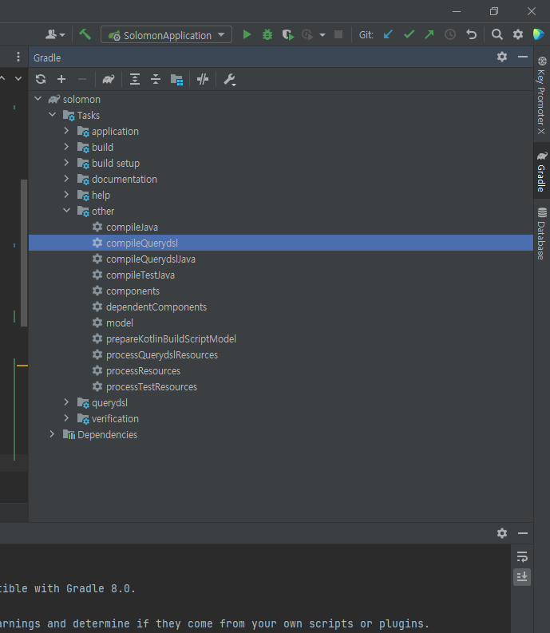

# Query DSL

<br>

##### :one: QueryDSL

- 정적타입을 이용해서 SQL과 같은 쿼리를 생성할 수 있도록 해주는 프레임워크

- SQL이나 JPQL을 코드로 작성할 수 있도록 도와주는 builder API


##### :two: Query DSL 사용하는 이유(장점)

- 도메인의 변경이 직접적으로 쿼리에 반영되고, 쿼리 작성 과정에서 코드 자동완성 기능을 사용함으로써 쿼리를 안전하고 빠르게 생성 가능
- <u>컴파일 시점에 문법 오류 발견 가능</u>
- 코드 모양이 JPQL과 거의 유사함
- 동적 쿼리


##### :three: 환경설정

- 환경설정에 있어서 IntelliJ와 이클립스는 차이가 있기 때문에 사용시 함부로 복붙하면 안된다.
- gradle(IntelliJ)

```gradle
plugins {
	...
	id 'com.ewerk.gradle.plugins.querydsl' version '1.0.10'
	...
}

dependencies {
	...
	// Querydsl
	implementation 'com.querydsl:querydsl-jpa:${queryDslVersion}'
	implementation 'com.querydsl:querydsl-apt:${queryDslVersion}'
}

// 하단 부분에 삽입
def querydslDir = "$buildDir/generated/querydsl"

querydsl {
	jpa = true
	querydslSourcesDir = querydslDir
}
sourceSets {
	main.java.srcDir querydslDir
}
compileQuerydsl{
	options.annotationProcessorPath = configurations.querydsl
}
configurations {
	compileOnly {
		extendsFrom annotationProcessor
	}
	querydsl.extendsFrom compileClasspath
}
```




##### :four: 문법

1. 검색 조건 쿼리
   - select()
   - from()
   - selectFrom() = select + from
   - where(), and(), or()
   - orderBy()
2. 동일성 체크
   - eq() : ==
   - ne() : !=
   - not() : !=
   - isNotNull() : null이 아니면 true
3. 원소, 범위 체크
   - in()
   - notIn()
   - between()
4. 결과 조회
   - fetch() : 리스트 조회 없으면 빈 리스트 반화
   - fetchOne() : 단일 객체 반환
   - fetchFirst() : 가장 먼저 찾는것을 반환


##### :pencil2: References

- https://hckcksrl.medium.com/querydsl-%EC%8B%9C%EC%9E%91%ED%95%98%EA%B8%B0-1259825181fb
- https://ict-nroo.tistory.com/117
- https://zzerosouth.tistory.com/27

