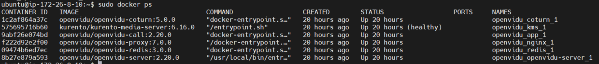

# WebRTC & OpenVidu

<br>

##### 1️⃣ OpenVidu란?

- 웹이나 모바일 애플리케이션에서 화상 통화 구현을 편리하게하는 플랫폼
- 애플리케이션에 통합하기 매우 쉬운 완전한 기술 스택 제공
- Openvidu Browser
    - 클라이언트 측에서 사용할 라이브러리
    - 화상통화를 만들고, 비디오와 오디오를 주고받을 수 있게 도와줌
    - Openvidu에서 사용할 수 있는 모든 작업은 Openvidu Browser 통해 관리
- Openvidu Server
    - 서버 측 내용을 처리하는 애플리케이션
    - Openvidu Browser에서 작업을 수신하고, 비디오 통화를 설정하고 관리하는데 필요한 모든 작업 수행
    - 명시적으로 구현할 필요X, 실행한 후 접근 가능한 IP만 알고있으면 됨!
    
    

##### 2️⃣ WebRTC란?

- Web Real-Time Communication
- 웹 브라우저 간에 플러그인 없이 서로 통신이 가능한 API
- 장점 : 지연시간이 짧으며, 보안성이 좋음
- 단점 : STUN/TURN 서버 필요


##### 3️⃣ Kurento란?

- WebRTC 미디어 서버
- WWW와 스마트폰 플랫폼을 위해 비디오 애플리케이션을 간편하게 개발할 수 있도록 도와주는 기술
- 그룹간의 통신, 녹음, 방송, 시청각 흐름의 라우팅 기술 지원


##### 4️⃣ OpenVidu 튜토리얼 해보기..!

- [https://docs.openvidu.io/en/stable/tutorials/openvidu-insecure-vue/](https://docs.openvidu.io/en/stable/tutorials/openvidu-insecure-vue/)


##### 5️⃣ Openvidu Server 설치

[전제조건]

- Certbot 설치
- SSL 인증서 발급 필요([https://blog.buffashe.com/2020/09/get-ssl-cert-via-letsencrypt/#SSL_인증서_발급_및_설정](https://blog.buffashe.com/2020/09/get-ssl-cert-via-letsencrypt/#SSL_%EC%9D%B8%EC%A6%9D%EC%84%9C_%EB%B0%9C%EA%B8%89_%EB%B0%8F_%EC%84%A4%EC%A0%95))

---

1. Openvidu에서 필요한 port 확보하기(port 확보시에 방화벽(ufw) 설정에 주의하기..!)
    - 22 TCP : SSH를 사용하여 관리자 OpenVidu 연결
    - 80 TCP : SSL 인증서를 생성하기 위해 Let’s Encrypt를 선택한 경우 생성 프로세스에서 사용
    - 443 TCP : https 포트에 게시
    - 3478 TCP+UDP : TURN 서버에서 클라이언트 IP 확인하는데 사용
    - 40000 ~ 57000 TCP+UDP : Kurento Media Server
    - 57001 ~ 65535 TCP+UDP : TURN 서버에서 사용
    
2. Openvidu 설치
    - /opt 디렉토리에 설치되는것을 권장함

```bash
$cd /opt
$sudo curl https://s3-eu-west-1.amazonaws.com/aws.openvidu.io/install_openvidu_latest.sh | sudo bash
```

3. 설정 파일 수정

- `DOMAIN_OR_PUBLIC_IP`=도메인 또는 ip주소
- `OPENVIDU_SECRET`=비밀번호
- `CERTIFICATE_TYPE=letsencrypt`
- `LETSENCRYPT_EMAIL`=실제 사용하는 이메일
- `HTTP_PORT=80`
- `HTTPS_PORT=443`

```bash
$cd /opt/openvidu
$sudo nano .env
```

4. openvidu 서버 실행

```bash
$sudo ./openvidu start
```

5. 컨테이너가 잘 작동하는지 확인하기

```bash
$sudo docker ps
```




##### 6️⃣ Nginx .conf 파일 설정

- /ect/nginx/site-available/test.conf
  
    (default 파일이 기본 파일이지만 변경해도 상관없음)
    

```bash
server {
        server_name 도메인;

        location / {
						// local에서 사용한 boot 포트 설정
            proxy_pass http://localhost:8080;
        }

        location /openvidu {
            proxy_pass http://127.0.0.1:5443;
		        proxy_set_header Upgrade $http_upgrade;
		        proxy_set_header Connection 'upgrade';
		        proxy_set_header Host $host;
		        proxy_cache_bypass $http_upgrade;
		   }

        location /dashboard {
            proxy_pass http://127.0.0.1:5443/dashboard;
				}

        # 에러 페이지 location 수정 필요.
        error_page 404 /404.html;
            location = /index.html {
        }
        error_page 500 502 503 504 /50x.html;
            location = /index2.html {
        }

    listen [::]:443 ssl ipv6only=on; # managed by Certbot
    listen 443 ssl; # managed by Certbot
    ssl_certificate /etc/letsencrypt/live/i6c207.p.ssafy.io/fullchain.pem; # managed by Certbot
    ssl_certificate_key /etc/letsencrypt/live/i6c207.p.ssafy.io/privkey.pem; # managed by Certbot
    include /etc/letsencrypt/options-ssl-nginx.conf; # managed by Certbot
    ssl_dhparam /etc/letsencrypt/ssl-dhparams.pem; # managed by Certbot

}

server {
    if ($host = 도메인) {
        return 301 https://$host$request_uri;
    } # managed by Certbot

        listen 80 default_server;
        listen [::]:80 default_server;

        server_name 도메인;
		    return 404; # managed by Certbot
	}
```


##### 7️⃣ Openvidu에서 제공하는 REST Api 사용

- [https://docs.openvidu.io/en/2.20.0/reference-docs/REST-API/](https://docs.openvidu.io/en/2.20.0/reference-docs/REST-API/)


📚 **Reference**

- [https://jini-space.tistory.com/12](https://jini-space.tistory.com/12)
- [https://2jinishappy.tistory.com/335](https://2jinishappy.tistory.com/335)
- [https://docs.openvidu.io/en/2.20.0/deployment/ce/on-premises/](https://docs.openvidu.io/en/2.20.0/deployment/ce/on-premises/)
- [https://github.com/483759/Square4Us/wiki/Openvidu-구축-과정#tv-webrtc-openvidu-server-구축-과정](https://github.com/483759/Square4Us/wiki/Openvidu-%EA%B5%AC%EC%B6%95-%EA%B3%BC%EC%A0%95#tv-webrtc-openvidu-server-%EA%B5%AC%EC%B6%95-%EA%B3%BC%EC%A0%95)