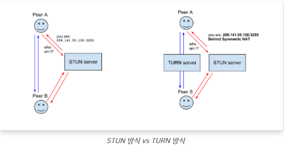
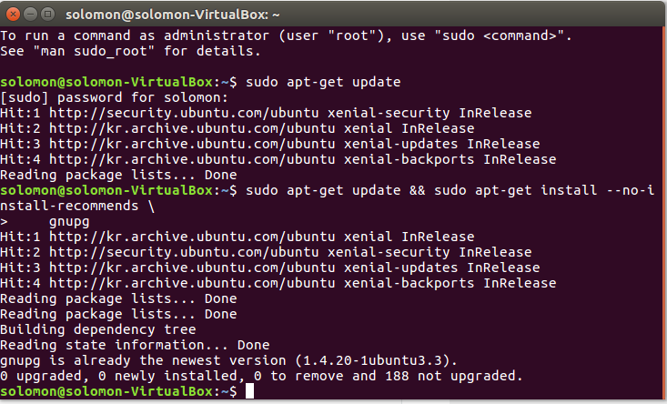
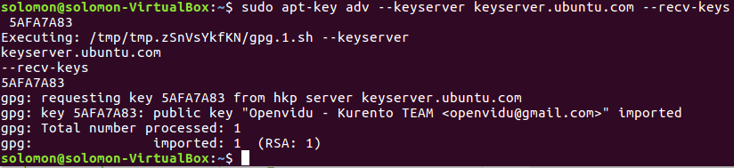
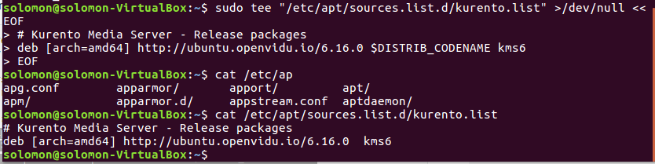
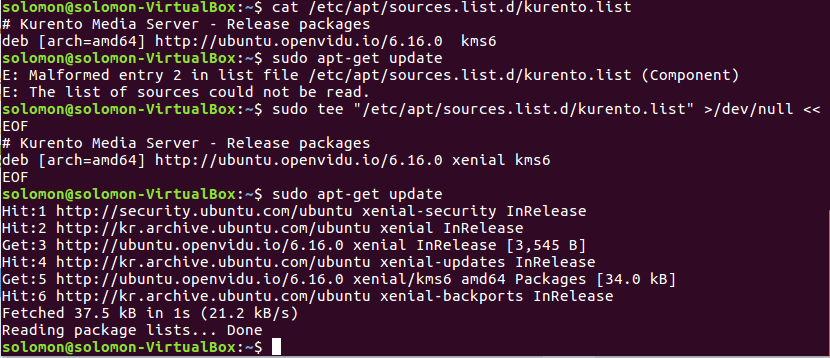
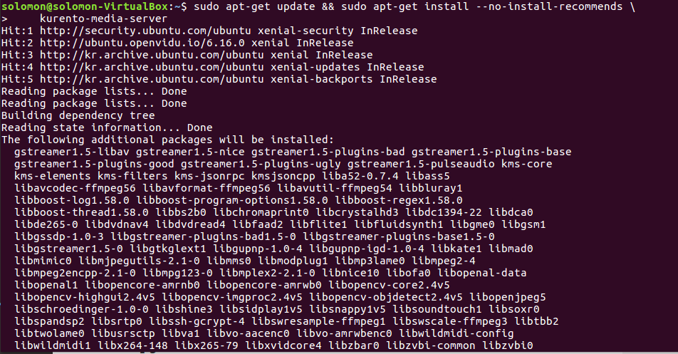
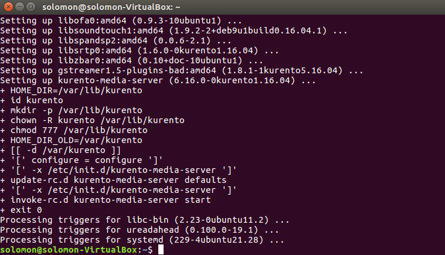
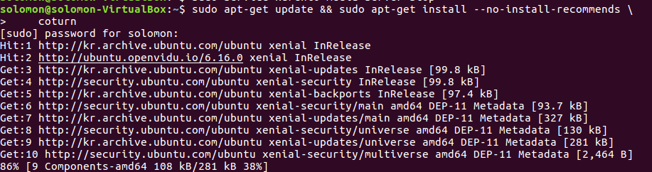
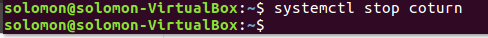
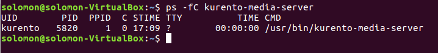

# WebRTC

> **WebRTC(Web Real-Time Communication)**은 웹 애플리케이션과 사이트가 중간자 없이 브라우저 간에 오디오나 영상 미디어를 포착하고 마음대로 스트림 할 뿐 아니라, 임의의 데이터도 교환할 수 있도록 하는 기술이다.
> 

→ 한마디로 드라이버나 플러그인 설치 없이 웹 브라우저 간 P2P 연결을 통해 데이터 교환을 가능하게 하는 기술

WebRTC API

[https://developer.mozilla.org/ko/docs/Web/API/WebRTC_API](https://developer.mozilla.org/ko/docs/Web/API/WebRTC_API)

WebRTC 실시간 데이터 교환

[https://wormwlrm.github.io/2021/01/24/Introducing-WebRTC.html](https://wormwlrm.github.io/2021/01/24/Introducing-WebRTC.html)

WebRTC (STUN, TURN 서버)

[https://andonekwon.tistory.com/59](https://andonekwon.tistory.com/59)

[http://john-home.iptime.org:8085/xe/index.php?mid=board_sKSz42&document_srl=1582](http://john-home.iptime.org:8085/xe/index.php?mid=board_sKSz42&document_srl=1582)

- WebRTC 개념 및 사용법
  
     : 여러가지 목적으로 사용될 수 있으며, Media Capture and Streams API와 상당히 많은 부분이 겹친다. 이 둘은 서로 상호작용을 하면서 웹에 강력한 멀티미디어 기능을 제공한다.
     
    두 피어 간의 커넥션은 [RTCPeerConnection](https://developer.mozilla.org/en-US/docs/Web/API/RTCPeerConnection) 인터페이스를 통해 이루어진다. 커넥션이 이루어지고 열리면, 미디어 스트림들([MediaStream](https://www.gitbook.com/?utm_source=legacy&utm_medium=redirect&utm_campaign=close_legacy#))과 데이터 채널([RTCDataChannel](https://www.gitbook.com/?utm_source=legacy&utm_medium=redirect&utm_campaign=close_legacy#))들을 커넥션에 연결할 수 있다.
    
    미디어 스트림들은 미디어 정보를 가지는 다수의 트랙들로 구성될 수 있다. [MediaStreamTrack](https://developer.mozilla.org/en-US/docs/Web/API/MediaStreamTrack) 인터페이스 object를 베이스로 하는 트랙은 음성, 영상 및 텍스트(제목 또는 챕터 이름 조차도 포함 가능하다)를 포함하는 다양한 미디어 데이터의 타입 중 하나를 포함할 수 있다.
    
    임의의 바이너리 데이터(이미지든 텍스트든 파일이든 모두 가능하다는 듯)를 [RTCDataChannel](https://developer.mozilla.org/en-US/docs/Web/API/RTCDataChannel) 인터페이스를 통해 피어들 간에 교환할 수 있다.
    
- WebRTC는 어떻게 실시간으로 데이터를 교환할 수 있을까?
시그널링이라고 일컫어지는 NAT 우회 과정을 거치기 때문이다.

- P2P 절차
    1. 각 브라우저가 P2P 커뮤니케이션에 동의
    2. 서로의 주소를 공유
    3. 보안 사항 및 방화벽 우회
    4. 멀티미디어 데이터를 실시간으로 교환
    
    - 방화벽과 NAT 트래버셜
    라우터를 통과해서 연결할 방법을 찾는 과정을 NAT 트래버셜(NAT traversal)이라고 한다.
    - STUN, TURN
    
    
    
    출처
    
    NAT 트래버셜 작업은 SUTN(Session Traversal Utilities for NAT) 서버에 의해 이루어진다. **STUN 방식은 단말이 자신의 공인 IP주소와 포트를 확인하는 과정에 대한 프로토콜이다.** STUN 서버는 ****인터넷의 복잡한 주소들 속에서 유일하게 자기 자신을 식별할 수 있는 정보(공인 IP와 포트)를 반환해준다. 
    
    하지만 STUN 서버를 이용하더라도 자기 자신의 주소를 찾아내지 못했을 경우 TURN(Traversal Using Relay NAT) 서버를 대안으로 이용하게 된다.
    
    **TURN 방식은 네트워크 미디어를 중개하는 서버를 이용하는 것이다.** TURN 방식은 중간에 서버를 한번 거치기 때문에, 엄밀히 이야기하자면 P2P 통신이 아니게 되며 그 구조상 지연이 필연적으로 발생하게 된다. 하지만 보안 정책이 엄격한 개인 NAT 내부에 위치한 브라우저와 P2P 통신을 할 수 있는 유일한 방법이기 때문에, TURN 방식은 최후의 수단으로 선택되어야 한다.
    
    - ICE와 Candidate
    STUN, TURN 서버를 이용해서 획득했던 **IP 주소와 프로토콜, 포트의 조합으로 구성된 연결 가능한 네트워크 주소**들을 **후보(Candidate)**라고 부른다. 이 과정을 후보 찾기(Finding Candidate)라고 부른다.
    
    일반적으로 3개의 주소를 얻음
    - 자신의 사설 IP와 포트 넘버
    - 자신의 공인 IP와 포트 넘버 (STUN, TURN 서버로부터 획득 가능)
    - TURN 서버의 IP와 포트 넘버 (TURN 서버로부터 획득 가능)
    
    이러한 모든 과정은 **ICE(Interactive Connectivity Establishment)**라는 프레임워크 위에서 이루어진다. ICE는 **두개의 단말이 P2P 연결을 가능하게 하도록 최적의 경로를 찾아주는 프레임워크**이다.
    - SDP
    - Trickle ICE
    - 시그널링
    - 

아직 XXXXXXXXXXXXXXXXXXX

Ubuntu : Ubuntu 16.04.7 LTS (Xenial Xerus)

[https://releases.ubuntu.com/16.04/](https://releases.ubuntu.com/16.04/)

- Kurento Media Server (KMS) 설치
  
    
    
    Ubuntu 20.04 LTS 버전에서는 아래와 같은 에러가 나는 것을 알 수 있다.
    
    ```
    이 방법을 사용하면 Kurento 프로젝트에서 제공하는 기본 Ubuntu 패키지 리포지토리에서 
    Kurento Media Server를 설치합니다. KMS는 Ubuntu의 두 가지 *LTS* (Long-Term Support ) 
    버전 **Ubuntu 16.04 (Xenial)** 및 **Ubuntu 18.04 (Bionic)** (64 비트 전용) 를 명시 적으로 
    지원합니다 .
    ```
    
    - local installation
        1. Make sure that GnuPG is installed.
        
        ```bash
        sudo apt-get update **&&** sudo apt-get install --no-install-recommends \
            gnupg
        ```
        
        
        
        1. Add the Kurento repository to your system configuration.
        
        시스템에 구성에 kurento 저장소 추가
        
        Run these commands:
        
        ```bash
        # Import the Kurento repository signing key
        sudo apt-key adv --keyserver keyserver.ubuntu.com --recv-keys 5AFA7A83
        
        # Get Ubuntu version definitions
        source /etc/lsb-release
        
        # Add the repository to Apt
        sudo tee "/etc/apt/sources.list.d/kurento.list" >/dev/null <<EOF
        # Kurento Media Server - Release packages
        deb [arch=amd64] http://ubuntu.openvidu.io/6.16.0 $DISTRIB_CODENAME kms6
        EOF
        ```
        
        
        
        
        
        
        
        1. Install KMS:
        
        ```
        sudo apt-get update && sudo apt-get install --no-install-recommends \
            kurento-media-server
        ```
        
        
        
        ...
        
        
        
    - Running
    
    ```
    sudo service kurento-media-server start
    sudo service kurento-media-server stop
    ```
    
    
    
- STUN/TURN server install
  
    Kurento Media Server, Application Server 또는 클라이언트가 [NAT](https://doc-kurento.readthedocs.io/en/stable/glossary.html#term-nat) 뒤에있는 경우 [NAT 통과](https://doc-kurento.readthedocs.io/en/stable/glossary.html#term-nat-traversal) 를 달성하려면 [STUN](https://doc-kurento.readthedocs.io/en/stable/glossary.html#term-stun) 또는 [TURN](https://doc-kurento.readthedocs.io/en/stable/glossary.html#term-turn) 서버 를 사용해야한다 . 대부분의 경우 STUN은 대부분의 소비자 네트워크 장치 (라우터)에서 NAT 문제를 해결하는 데 효과적이다. 그러나 많은 회사 네트워크에서는 작동하지 않으므로 TURN 서버가 필요하다.
    
    ```
    TURN에서 제공하는 기능은 STUN에서 제공하는 기능의 수퍼 세트이다.
    이는 이미 TURN 서버를 사용중인 경우 STUN 서버를 구성 할 필요가 없음을 의미 한다.
    Coturn은 STUN 서버 및 TURN 릴레이로 ICE 프로토콜에 필요한 모든
    기능을 지원하고 NAT 뒤에서 WebRTC 연결을 설정할 수 있다.
    ```
    
    - How to install Coturn?
    



- 설치를 하면 자동으로 실행되기 때문에 stop 해줘야한다.

  

  파일 설정에 들어가기 앞서

  본인의 외부 ip주소를 알아야한다.

  private ip : ifconfig

  public ip : hostname -I

  를 통해 얻도록 한다.

  ```jsx
  sudo vi /etc/turnserver.conf
  ```

  

  ```
  간략한 주석들 설명
  
  # turnserver의 포트입니다.
  listening-port=3478
  # tls 포트입니다.
  tls-listening-port=5349
  # 외부IP를 넣어줍니다.(공유기 사용시 WAN상의 외부IP를 넣어줍니다.)
  external-ip=123.123.126.123
  # 로그를 뽑을 수 있으니 주석을 해제하였습니다.
  verbose
  # 이것도 주석해제
  fingerprint
  # 인증방식 주석해제
  lt-cred-mech
  # turnserver 도메인 네임입니다.
  server-name=test.com
  # 릴름은 원하는 네임명으로 해줍니다.
  realm=testname
  # turn 로그인 계정(id:guest, pw:ssafy123)
  user=guest:ssafy123
  ```

  ```jsx
  /etc/kurento...
  ```

  


- Check your installation
  
    KMD server를 시작한 후 잘 실행되고 있는지 확인한다.
    
    ```
    $ ps -fC kurento-media-server
    UID        PID  PPID  C STIME TTY          TIME CMD
    kurento   7688     1  0 13:36 ?        00:00:00 /usr/bin/kurento-media-server
    ```
    
    
    
    달리 구성하지 않으면 KMS는 IPv6 포트 `8888`에서 수신하여 RPC 요청을 수신하고 [Kurento 프로토콜](https://doc-kurento.readthedocs.io/en/stable/features/kurento_protocol.html) 을 통해 RPC 응답을 보낸다 . 이 명령을 사용하여이 포트가 열려 있고 들어오는 패킷을 수신하고 있는지 확인한다.
    
    ```
    $ sudo netstat -tupln | grep -e kurento -e 8888
    tcp6  0  0  :::8888  :::*  LISTEN  7688/kurento-media-
    ```
    
    
    

  